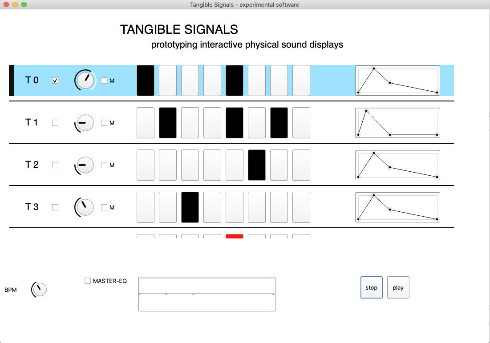

# Tangible Signals - experimental software

Experimental software for testing the [Tangible Signals](https://tamlab.ufg.at/projects/tangible-signals/) devices. Simple 8-step sequencer with 4 instruments, envelopes and Master-Eq.

screenshort:

